# Laboratório: Implementando uma API Segura com Azure API Management e Microsoft Entra ID
### Objetivo Principal
#### Criar uma API de pagamentos segura no Azure, integrando API Management (APIM) e Microsoft Entra ID para controle de acesso via tokens JWT e subscription keys.

# Ferramentas usadas:
- Azure
- Postman

## Parte 1: Criação do API Management:

### Criação do APIM:
- Na página inicial do Azure, clique em "Criar um recurso".
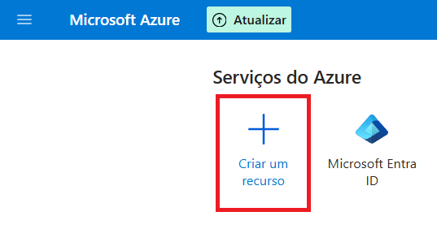

- No Marketplace, busque por "APIM" na barra de pesquisa da seção. Procure por "API Management", clique na seta ao lado de "Criar" e selecione "API Management".
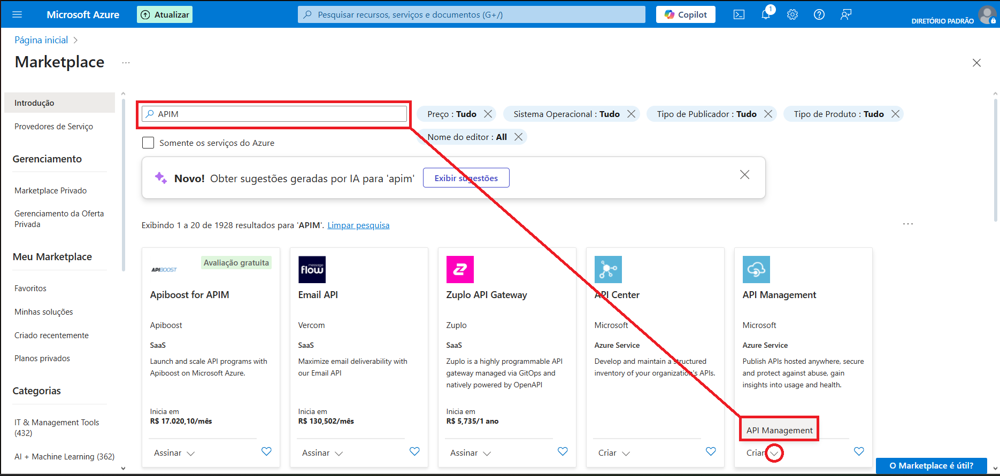

- Na aba "Basics", defina:
#### Detalhes do projeto:
```
Subscription: Use a sua assinatura.
    
    Grupo de recursos: Se não tiver um, crie.
```

#### Detalhes da instância:
```
Região: Considere custos e sendo a mais próxima dos usuários.

Nome do recurso: A seu critério.

Nome da organização: Nome da empresa.

Email do administrador: Autodescritivo.
```
## **Explore as outras abas antes de criar o APIM**
### Aba "Monitor + secure":
- Log Analytics (monitoramento avançado e insights sobre suas APIs):
```
    Para uma API de pagamentos, mesmo que simulada, monitoramento é crucial. Aqui você poderá visualizar as chamadas à API, erros, latência, etc.
```
- Defender para APIs no Microsoft Defender para Nuvem (Aumente a segurança da sua API):
```
    O tema do projeto é "API de Pagamentos Segura". Habilitar o Defender para APIs demonstra um compromisso com a segurança.
```
- Application Insights:
```
    O Application Insights é complementar ao Log Analytics e focado na performance e disponibilidade da aplicação. Ele é excelente para monitorar a saúde da API em tempo real, identificar gargalos e diagnosticar problemas de desempenho. Em uma API de pagamentos, performance e disponibilidade são críticas.
```
### Aba "Managed identity":
```
    As identidades gerenciadas são um conceito fundamental de segurança e boas práticas no Azure, especialmente quando se trata de acesso a outros serviços.
    Habilitar a identidade gerenciada permite que o seu APIM se autentique nesses outros serviços do Azure sem precisar de senhas ou chaves embutidas no código ou nas configurações.
```
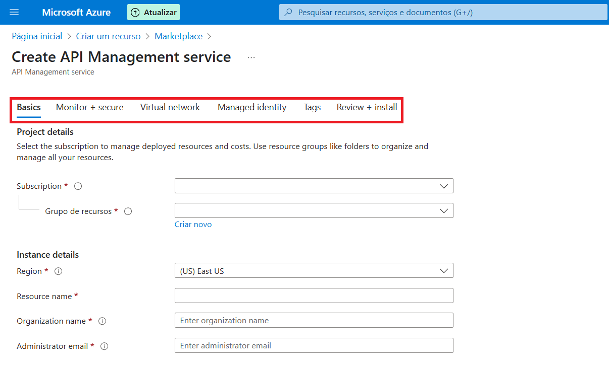

```
Pricing tier: Antes de escolher, veja a tabela de preço e funções.

Dica: Para ambientes de desenvolvimento, use Developer ou Basic (suporta portal, múltiplos gateways e políticas).

Para criar o APIM basta clicar no botão "Review + create". Depois que a revisão terminar, clica em "create" para finalizar o processo.
```
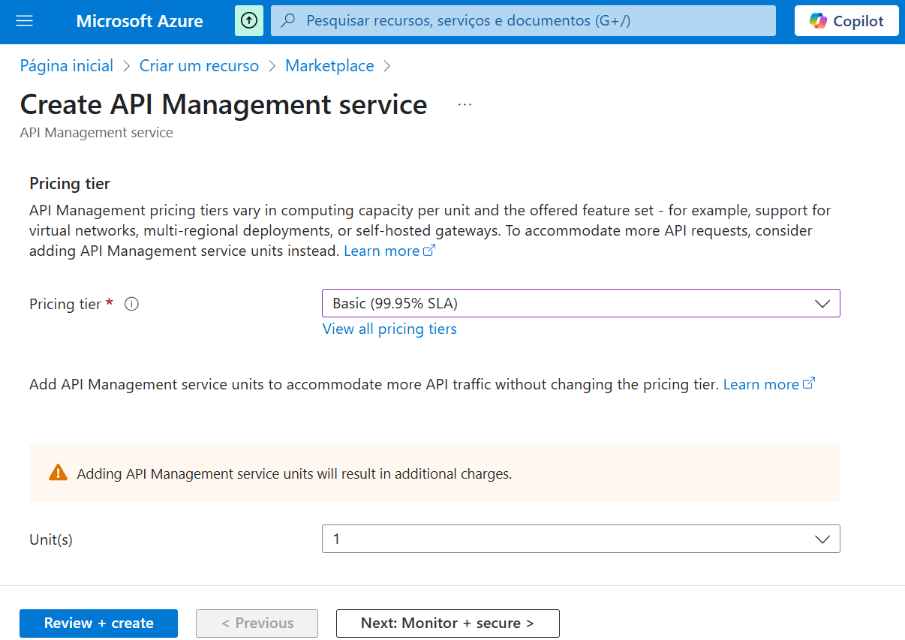


## Parte 2: Criação do Aplicativo Web:
- Na página inicial do Azure, clique em "Criar um recurso".


- No Marketplace, busque por "Aplicativo web" na barra de pesquisa da seção. Procure por "Aplicativo web", clique na seta ao lado de "Criar" e selecione "Aplicativo web".
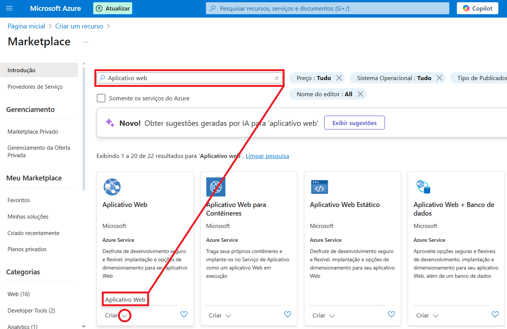

### Detalhes do projeto:
```
Assinatura: Use a sua assinatura do Azure.
    
    Grupo de recursos: Se não tiver um, crie.
```
### Detalhes da instância:
```
Nome: A seu critério.

Publicar: 
    Código: Para as atividades de desenvolvimento, publicar "Código" é a opção mais direta e simples. Você pode fazer o deploy do seu código (seja Python, Node.js, C#, etc.) diretamente para o App Service.

    Contêiner: Adiciona uma camada de complexidade. Para o escopo de uma atividade onde o foco é a API e o APIM, "Código" é mais direto e te permite focar no essencial.
```
## **Explore as outras abas antes de criar o Aplicativo web**
- Aba "Banco de dados":
```
Não é estritamente obrigatório neste momento.
Para a demonstração e o objetivo de mostrar a integração do Azure API Management com uma API backend segura, uma API com dados em memória é suficiente.
O foco principal, é a parte de segurança e a gestão da API pelo APIM, e não a persistência de dados em si.

Vantagem de não usar banco de dados agora: Reduz a complexidade, o tempo de configuração e evita custos adicionais.
```
- Aba "Implantação":
```
Desabilitar a autenticação básica força o uso de práticas de segurança mais robustas para a implantação, o que está totalmente alinhado com o tema do projeto.
```
- Aba "rede"
```
Para o projeto, a escolha de "Desativado" para o acesso público do Aplicativo Web é a que alinha a segurança e o controle de acesso, fazendo com que o API Gateway seja, de fato, o único ponto de entrada para a API.
```
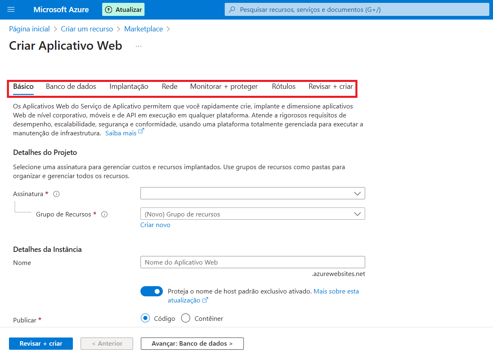
### Detalhes da instância:
- Pilha de runtime:
```
Se você vai codificar sua API em Python, escolha "Python". Se for em Node.js, escolha "Node.js", e assim por diante.

Exemplo: Se você escolher Python, selecione a versão mais recente e estável disponível (ex: Python 3.9, 3.10, 3.11).
```
- Região:
```
Manter a mesma região para todos os seus recursos ( APIM, Log Analytics etc) é uma ótima prática por motivos de latência, custos e organização.
```
- Planos de Preços:
```
Se foi criado ou sugerido algum nome, provavelmente ele está dentro do seu grupo de recursos e é o plano padrão para aquela região. Reutilizá-lo é eficiente, pois você não precisa criar um novo plano e pagar por recursos adicionais. Para uma atividade, um único plano geralmente é suficiente.
```
- Redundância de zona:
```
 Para um projeto de atividade, o foco é demonstrar a funcionalidade da API e a integração com o APIM e Microsoft Entra ID. A alta disponibilidade extrema da redundância de zona não é um requisito. Ela também tem um custo associado e só está disponível em planos de preço mais caros (como Premium V2 ou V3). O plano Gratuito F1 ou Básico B1 não suportam redundância de zona.
```
- Para publicar o aplicativo clique em "Revisar + criar" e depois em "Criar".
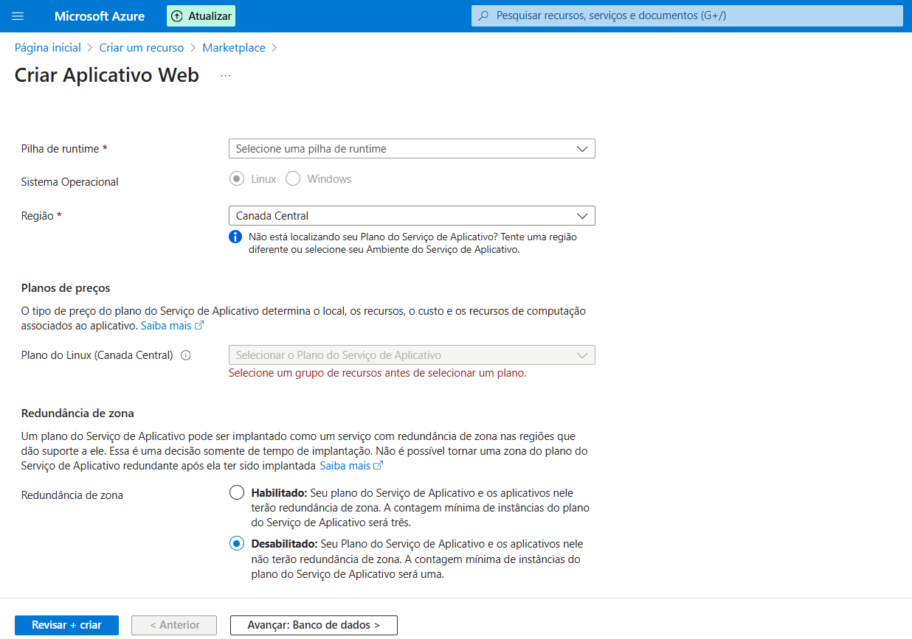

## Parte 3:
- No aplicativo web criado, vá na barra de pesquisa da seção e digite "CORS".
- Em "Solicitar Credenciais", habilite o acesso.
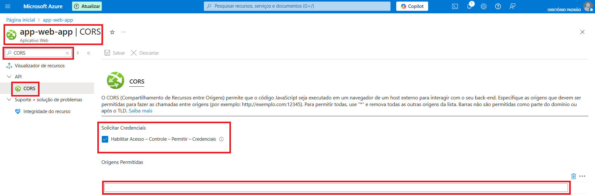
- Em "Origens Permitidas", você deve colocar o Gateway URL que aparece no API Management service(para que ele só responda a esse endereço):
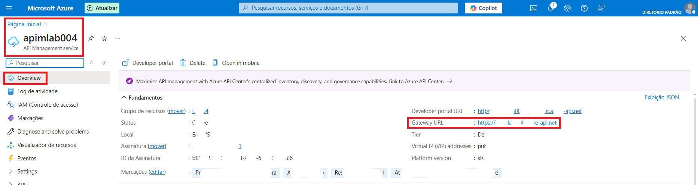
- Não se esqueça de salvar tudo que fizer.
## Parte 4: Criando a API pagamento:
- No API Management service, siga a rota mostrada na imagem:
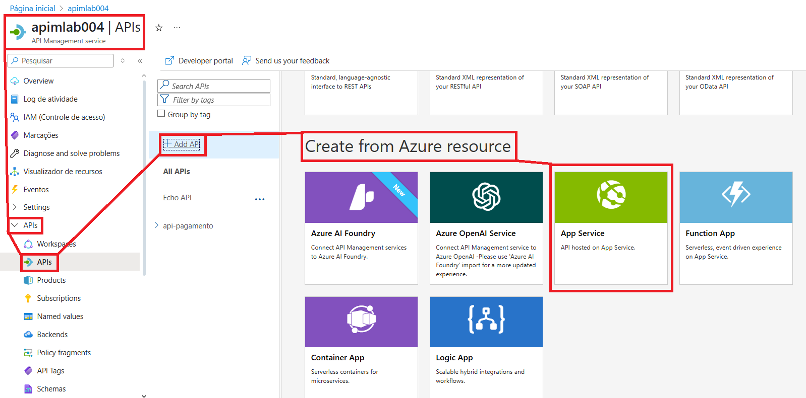
- Formate o serviço:
```
Em "Browse", selecione o aplicativo que você criou.

O nome nos campos seguintes para preencher ficam a seu critério.
```
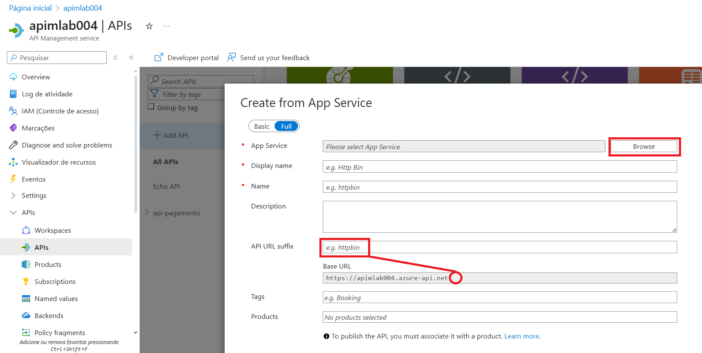
- Depois de preencher tudo, clique em "Create".
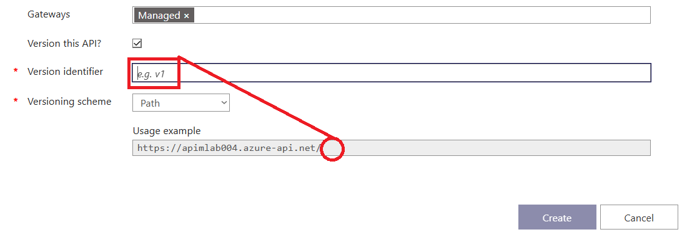
- Depois de criado, siga a rota mostrada na imagem:
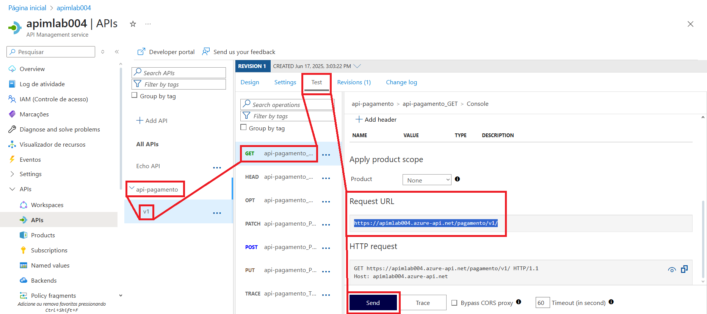

## Parte 5: Mudando endereço de rede:
- Siga a rota mostrada na imagem:
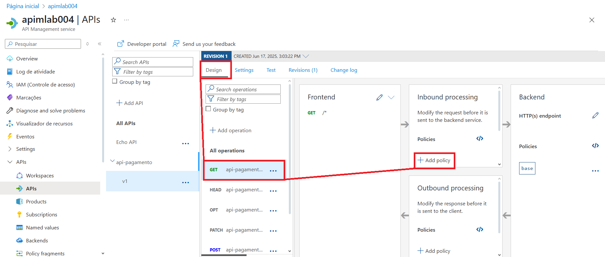
- Role a página até encontrar "Rewrite URL" e clique:
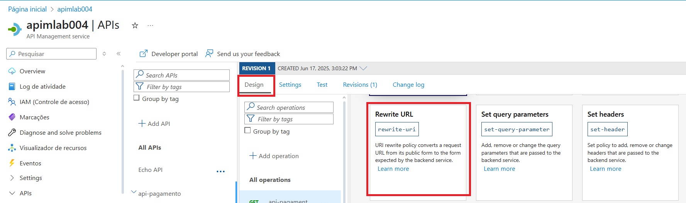
- Em "Backend" digite "weatherforecast" e clique em "Save":
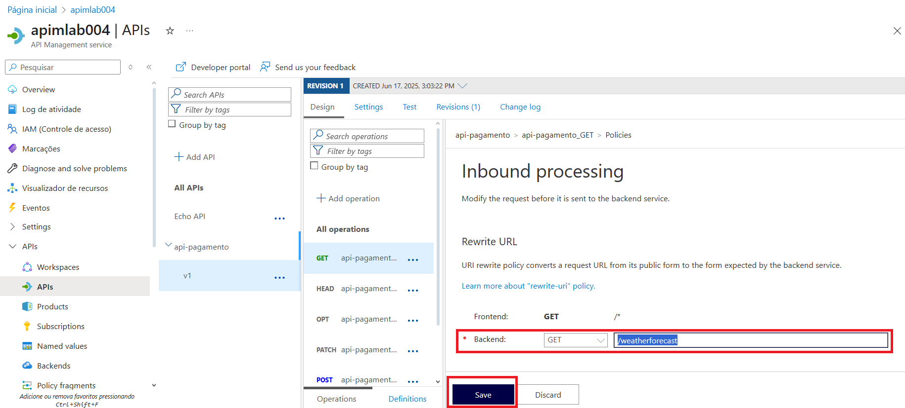
- Siga a rota mostrada na imagem seguinte e role a página até encontrar a seção "Subscription". Qualquer nome que esteja em "Header name" e "Query parameter name", substitua por x-api-key e clique em "Save".
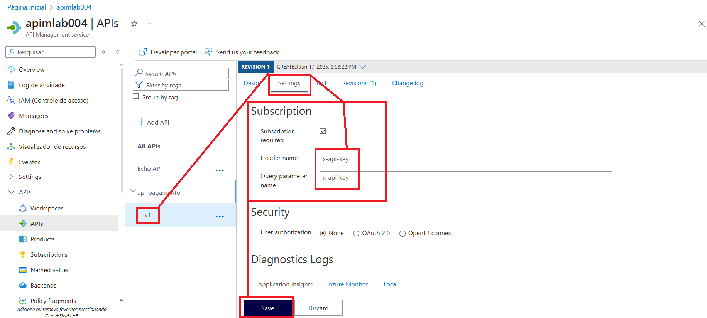
- Agora vá para a seção "Subscription" e crie uma nova, como na imagem e formate como desejar:
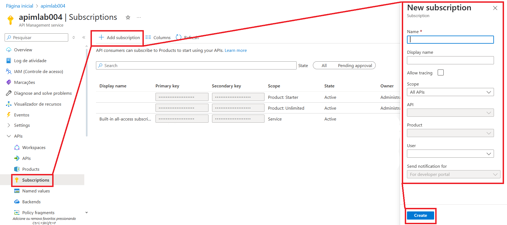
- Depois de criado a nova subscription, selecione os três pontinhos e depois Show/hide keys. Extraia a "Primary key" da sua nova criação e salve em um bloco de notas, para ser consultado depois:
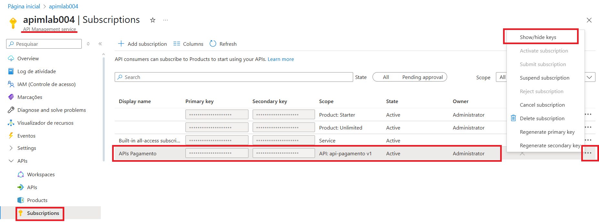
## Parte 6: Registro do Aplicativo:
- 1.Vá para a página inicial do Azure e clique em "Microsoft Entra ID":
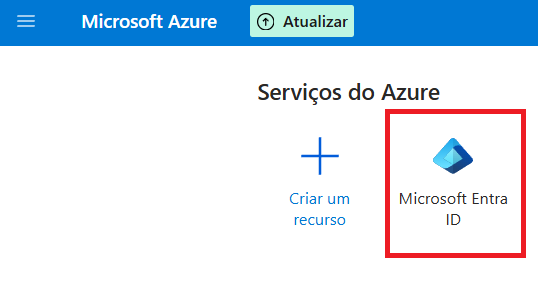
- 2.Siga o que está na imagem:
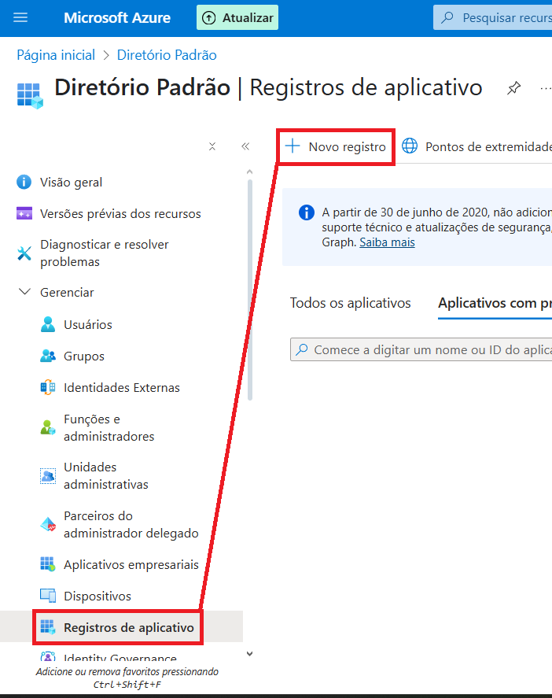
- 3.Registre o aplicativo novo com a formatação que desejar.
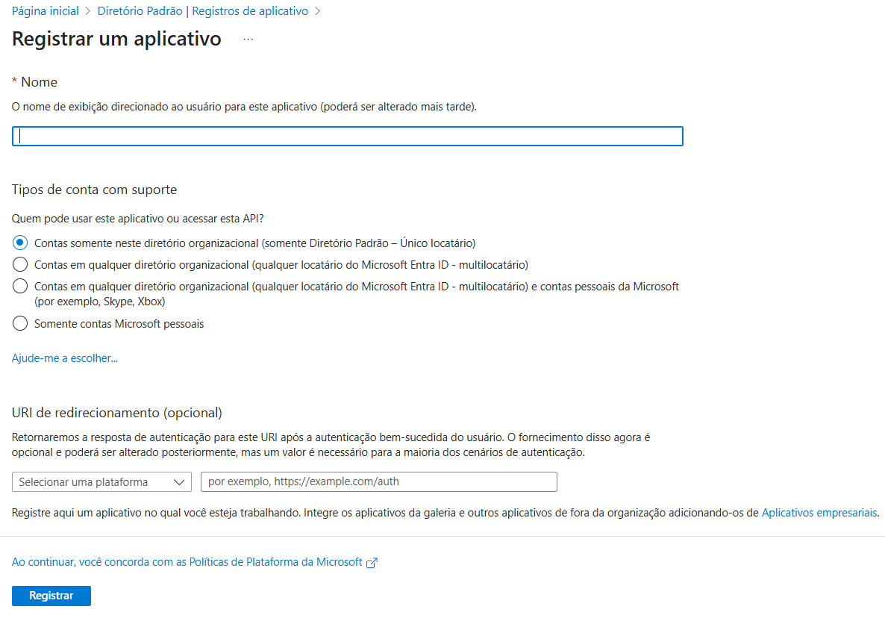
- 4.Depois de criado o aplicativo, copie o código que está em "ID do aplicativo(cliente)" e salve em um bloco de notas, para ser consultado depois.
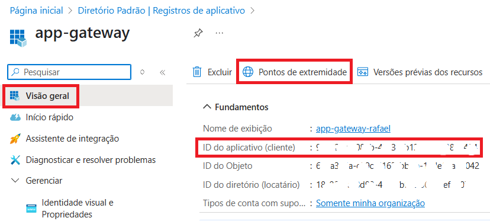
- 5.Clique em "Pontos de extremidade", na aba que abrir, procure por "Ponto de extremidade do token..." e copie o código. Salve em um bloco de notas, para ser consultado depois.
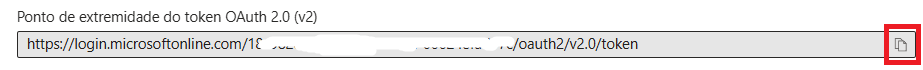
- 6.Depois, na mesma aba, procure por "Documento de metadados..." e copie o código. Salve em um bloco de notas, para ser consultado depois.
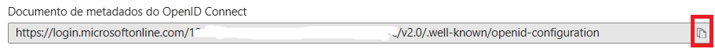
- 7.Agora siga o caminho mostrado na imagem a seguir. Crie uma nova secret e não esqueça de copiar o valor dela no bloco de notas.
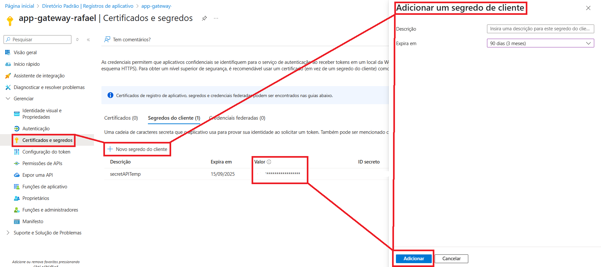
- 8.Crie funções para os usuários(ex: sendMessage e Reader):
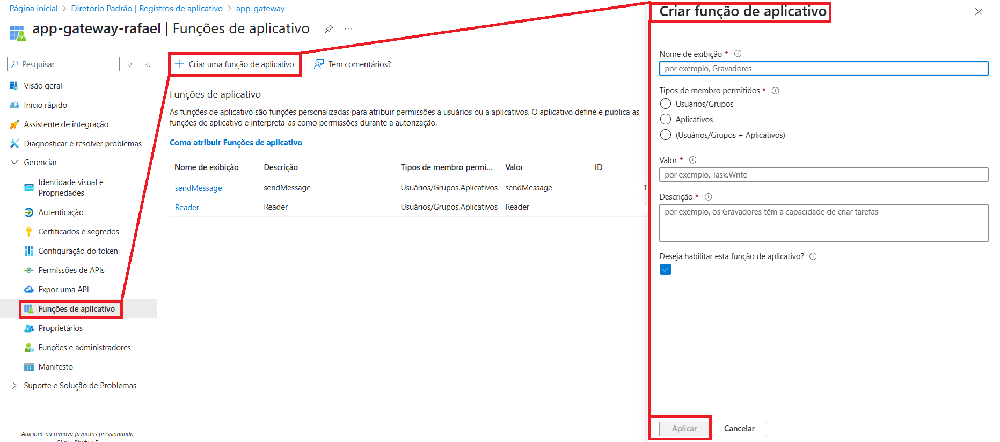

## Parte 7: Teste no Postman:
- Agora é o momento de usar alguns dos códigos salvos no bloco de notas.
## Na Parte 6.4:
```
Pegue o "ID do aplicativo(cliente)" e insira na coluna "Value" do Postman.

Na coluna "Key", digite "client_id".
```
## Na Parte 6.5:
```
Pegue a URL do "Ponto de extremidade do token..." e insira na barra superior do Postman, onde no lado esquerdo está escrito "GET".
```
## Na Parte 6.7:
```
Pegue o valor da secret e insira na coluna "Value" do Postman.

Na coluna "Key", digite "client_secret".
```
## Chaves e valores fornecidos pelo instrutor:
```
Na coluna "Value" insira client_credentials e na coluna "Key", insira grant_type.
```
```
Na coluna "Value" insira "https://graph.microsoft.com/default" e na coluna "Key", insira scope.
```
```
Finalizada essa parte, aperte "Send", localizado na parte direita.

É esperado que no terminal do Postman apareça algo semelhante ao o que está na parte inferior da imagem("{
    "token_type": "Bearer",..."):
```
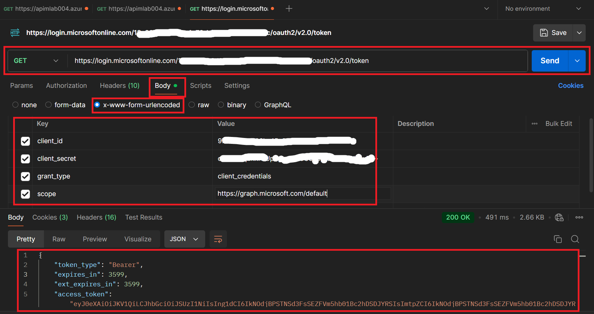
## Parte 8: Permissões
- Ainda no terminal do Postman, copie o código que aparece depois de ""access_token":" e cole ele no terminal do site jwt.io:
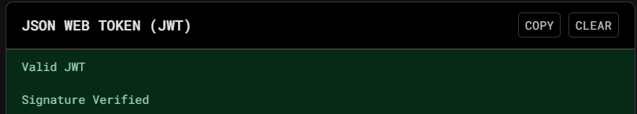
- Você não verá no terminal do jwt.io, as funções para usuários criadas. Por isso, terá que configurar as permissões de APIs:
```
Digite na barra de busca o app a ser usado e selecione as permissões que quer conceder e clique em "adicionar permissões". Após isso, clique em "Grant" ou "Conceder consentimento do administrador para Diretório Padrão". 
```
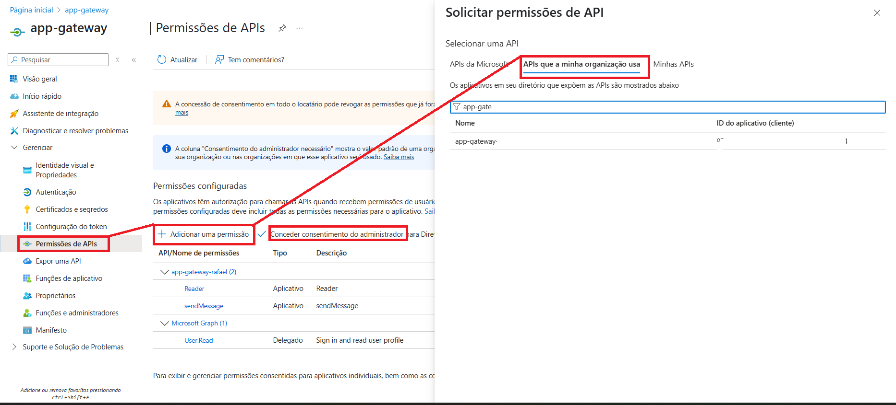
```
Espere de 15 a 25 minutos para executar a Parte 7 novamente.
```
## Parte 9: Configurar a validação da JWT
- Siga a rota mostrada na imagem:
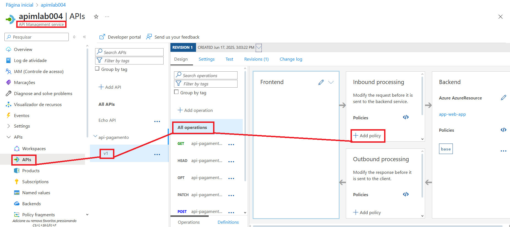
- Role a página até encontrar "Validate JWT":
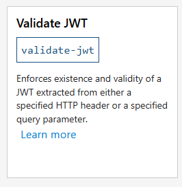
- Selecione "Full" e nessa primeira parte, formate do jeito que quiser.
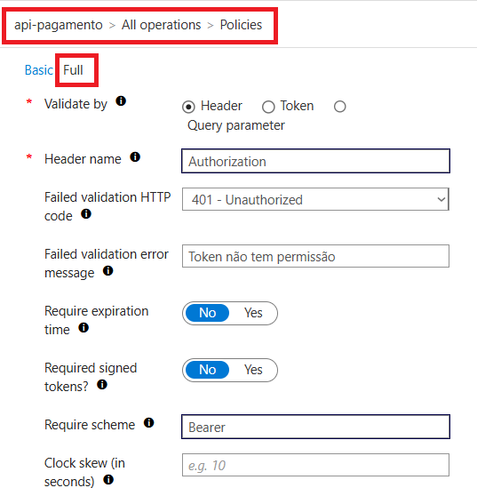
- Antes de completar a segunda parte, você terá que fazer uma outra configuração:
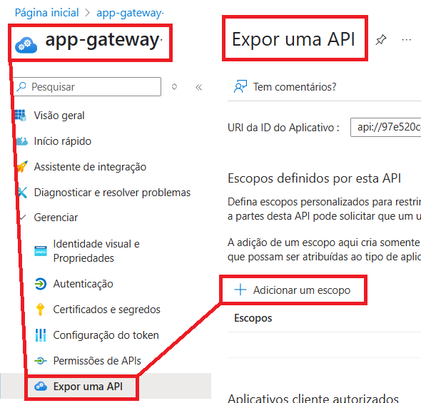
```
Depois que clicar em "Adicionar um escopo", vai abrir uma aba com uma URI. Aperte "Salvar e continuar", depois é só formatar:
```
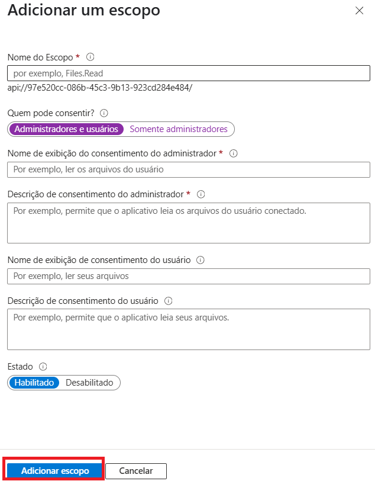
- Voltando para formatar a segunda parte do "Validate JWT":
```
As URLs da imagem a seguir, você encontra quando copia o token quando executa a Parte 7 e cola ele no site jwt.io. No terminal do site, procure por "aud" e "iss"(Audiences e Issuers, respectivamente). Copie os códigos contidos em "aud" e "iss" e coloque nos seus respetivos campos, com https e sem https:
```
```
Pegue também a URL  do Open ID, localizada na parte 6.6 deste tutorial e coloque em "Open ID URLs":
```
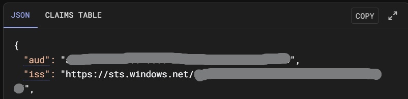
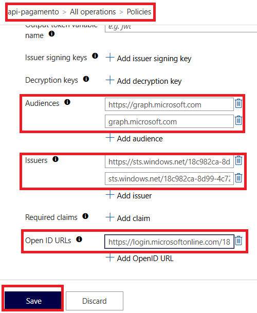
- No Postman, use a URL que foi formatada na Parte 4:
```
Na coluna "Key" digite "x-api-key" e na coluna "Value" Insira a "Primary key" do último passo da Parte 5.

Na coluna "Key" digite "Authorization" e na coluna "Value" Insira o nome que você escolheu em "Require scheme" do terceiro passo da Parte 9. Acrescente a esse nome o token que foi fornecido no último passo da Parte 7(Veja o exemplo na imagem):
```
- Clique em "Send" para executar o comando:
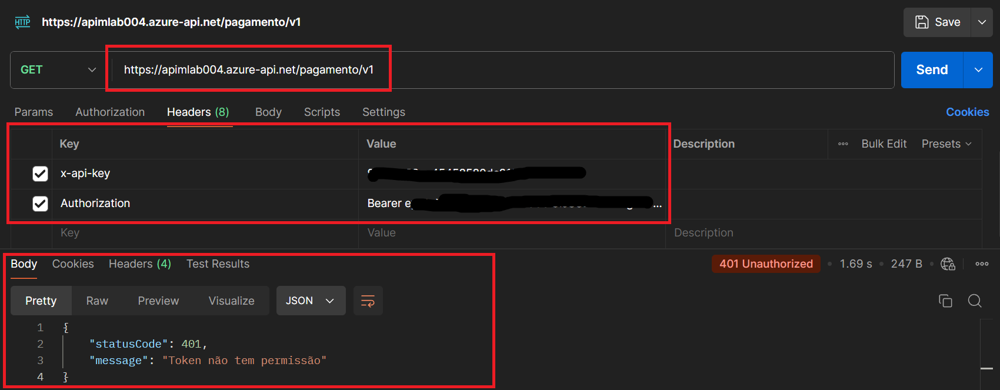
- No terminal, diz que o "Token não tem permissão", então vai ter que ser feita uma modificação manualmente. Segue a rota:
```
No passo quatro, da Parte 9 pegue o código da configuração da API(na parte de "Expor uma API") e substitua o "https://graph.microsoft.com", mas mantenha o "/.default" no código novo do último passo da Parte 7(no "Value" do scope).

Aperte send e colete o novo token, para ser inserido no terminal do jwt.io.
```
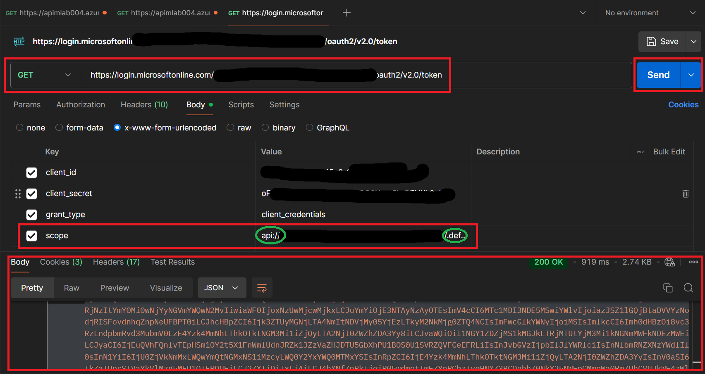
- Terminal do site jwt.io:
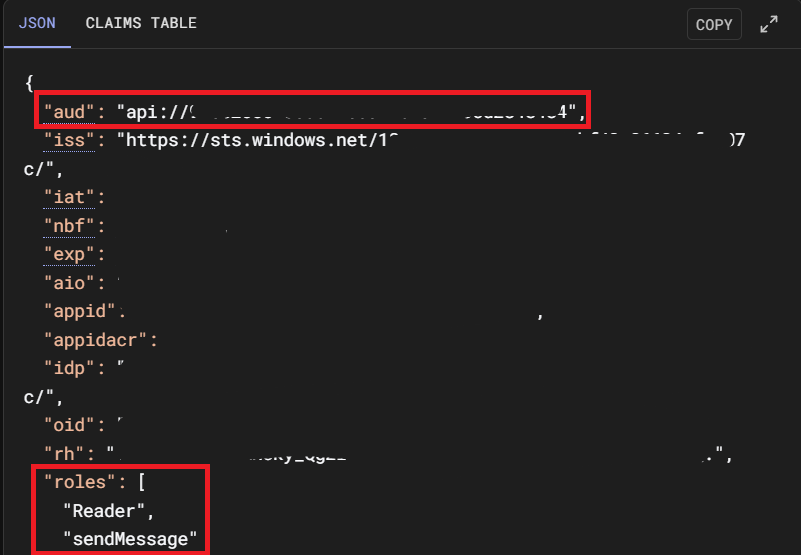
```
Perceba que além do "aud" ter mudado, "roles" também apareceu. 
```
- Seguindo para outra configuração manual:
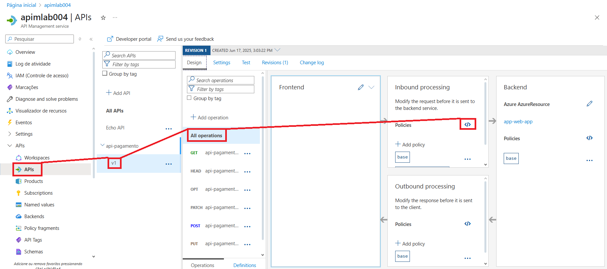
- Dentro do </>, vá para:
```
<audicence>https://graph.microsoft.com</audicence>.

Substitua o "https://graph.microsoft.com" pelo "api://...(sem o /.default)".
```
- Atualize o token no "Value" e aperte em "Send". O resultado esperado é aquele que aparece na parte inferior da imagem:
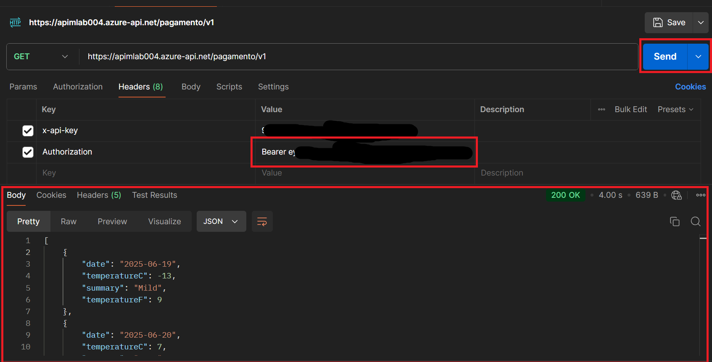
